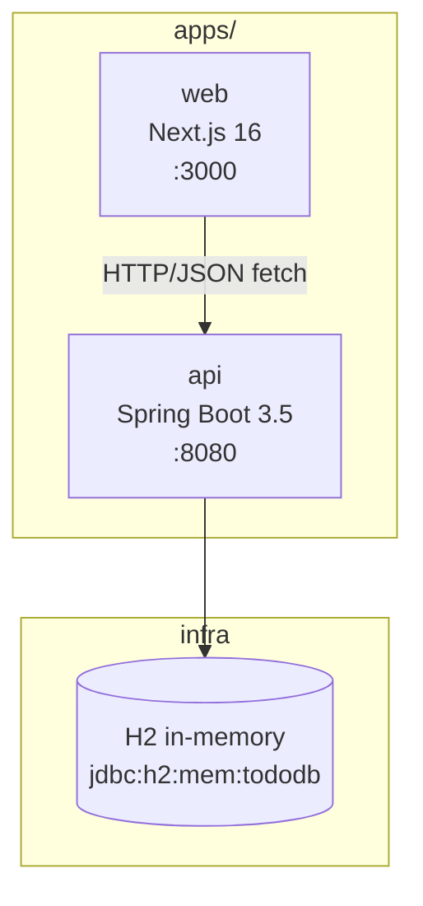

# Architecture — Monorepo Overview

**Last updated:** 2026-06-02

Mapa do sistema. Para detalhes de cada subsistema, siga os links para os outros docs evergreen.

## System diagram



Linhas cheias = dependência runtime. O front e o back são **processos separados** que se comunicam via HTTP.

## Apps

| App | Framework | Porta | Propósito |
| --- | --- | --- | --- |
| `api` | Spring Boot 3.5.3 + Java 17 | 8080 | REST API — CRUD de tarefas |
| `web` | Next.js 16.2 + TypeScript | 3000 | Frontend — lista, cria, edita e deleta tarefas |

### Backend (`apps/api`)

Gerenciado com **Maven** (`mvnw`). Package root: `com.springnexttodo`.

```
src/main/java/com/springnexttodo/
  task/              # feature slice: entidade, repo, service, controller, DTOs
  config/            # CORS, JPA Auditing, SeedData
  common/            # ApiError, GlobalExceptionHandler
```

Camadas: `Controller → Service → Repository (JPA) → Entity`

### Frontend (`apps/web`)

Gerenciado com **npm**. App Router do Next.js.

```
src/
  app/               # rotas (page.tsx server components)
  components/tasks/  # TaskList, TaskItem, TaskForm, TaskEditDialog (client)
  lib/api.ts         # client fetch tipado para a API
```

## Conventions globais

**Commits atômicos** com prefixo semântico: `feat|fix|docs|refactor|test(scope): msg`.  
**Branch protection:** `main` é protegida — merge apenas via PR.  
**Bilíngue:** títulos e nomes técnicos em inglês, prosa em português.

## Related docs

- [domain-model.md](domain-model.md)
- [api-routes.md](api-routes.md)
- [local-development.md](local-development.md)